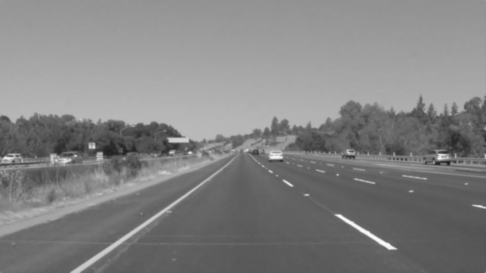
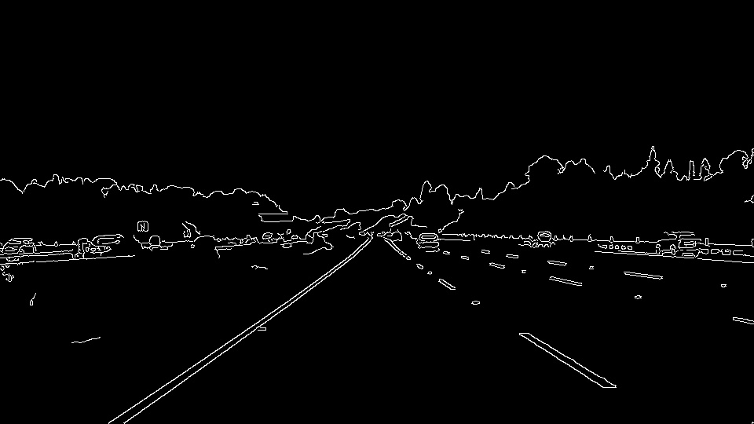
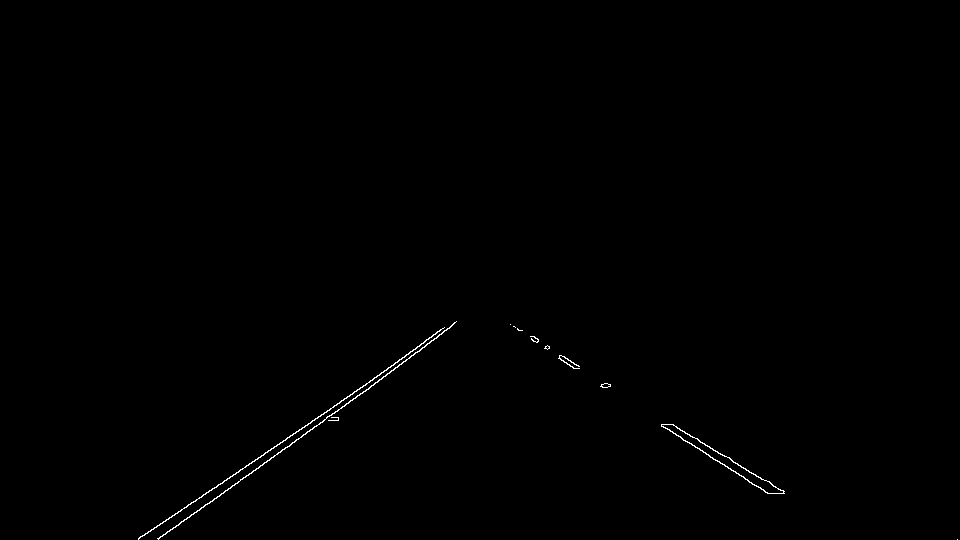
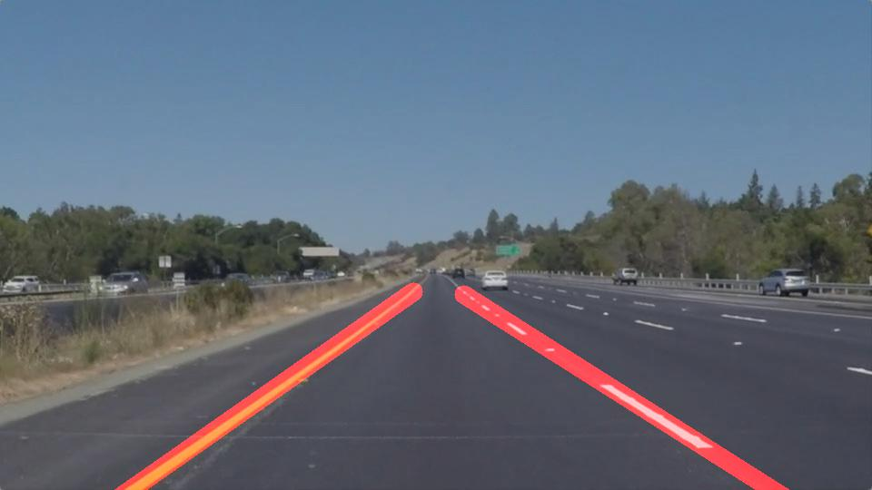

# **Finding Lane Lines on the Road** 

**Finding Lane Lines on the Road**

The goals / steps of this project are the following:
* Make a pipeline that finds lane lines on the road
* Reflect on your work in a written report

[//]: # (Image References)

[image1]: ./img_grayscale.jpg "Grayscale"
[image2]: ./img_blur.jpg "Blur"
[image2]: ./img_canny.jpg "Canny"
[image2]: ./img_masked.jpg "Masked"
[image2]: ./img_withlines.jpg "Image with line"

---

### Reflection

### 1. Describe your pipeline. As part of the description, explain how you modified the draw_lines() function.
My Pipeline consisted of five (5) steps. First, I converted the images to grayscale images. This will make it easier for detecting edges in the images later on. Next, I applied a Gaussian blur with a kernel size of 5. This is done to reduce image noise and smoothen edges. After that, I pass the image through a canny edge detection function with a low to high threshold ratio of 1:3. Next, I masked out a region of interest from the image. This is the region I most likely expect to find the lane lines. And finally, I detect Hough lines from the resulting image and marked out the lane lines.

In other to draw a single line on the left and the right lanes, I modified the draw_lines() function as follows:
First, I separated the lines (points that define the lines) into their respective regions either they make up the left lane or right. I did this by checking the value of the slope of the lines. Generally, lines with a positive slope make up the right lane and line with negative slope make up the left lane.

Next, I extracted the X-point values and Y-point values of each lane to calculate the coefficients of the lines they form.
Using these coefficients (slope and bais), I can generate any point that lies on each lane. 
At the final step, I generate 10 points that will lie on the line within a range form the near view to the far view into the image. The result are solid lines making the lane line detected.

To better identify lines that make up a lane in the images, I decided to add a cutoff_slope parameter to the draw_lines() function. The idea is that lines with a smaller slope below the cutoff ranges are most likely horizontal lines (false positive) which do not add much value to helping us detect lane lines. The inclusion of this parameter greatly helps in detecting lines in the challenge video with the front of the car visible in my region of interest. Basically, those lines are ignored.

Step 1. Grayscale image

Step 2. Blured image

Step 3. Canny edge detection

Step 4. Masked out Region of Interest

Step 5. Image with lines

Result: Image with marked lanes

<video width="960" height="540" controls>
  <source src="./test_videos_output/solidWhiteRight.mp4" type="video/mp4">
</video>

### 2. Identify potential shortcomings with your current pipeline

The pipeline does not correctly detect curved lanes.
The pipeline sometimes is thrown off by horizontal lines in the images.

### 3. Suggest possible improvements to your pipeline

To be able to detect curved lanes. This can possibly be done by fitting the lines using a higher
degree polynomial.

It may be advantageous to keep in memory the lines previously detected and with small incremental changes update current detected lines. Also, an advantage with this is when there is a disturbance in the system and the pipeline completely fails to detect lanes, previous information can be used to mark out approximate lanes.